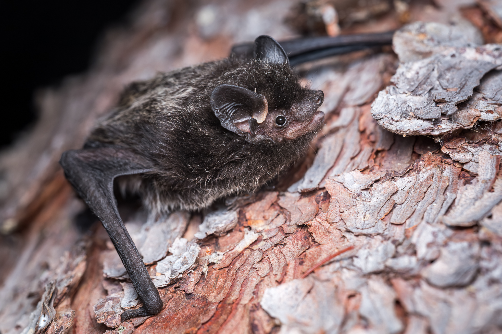



## Land Acknowledgement

Biodiversity Pathways respectfully acknowledges that our work takes place on treaty lands as well as the traditional and unceded territories of First Nations, Inuit, and Métis Peoples across all regions of Canada, whose histories, languages, and cultures are deeply connected to the biodiversity we monitor. We acknowledge the traditional teachings of the lands that we work on, and that reciprocal, meaningful, and respectful relationships with Indigenous peoples make our work possible. We are deeply grateful for their stewardship of these lands, and we are committed to supporting Indigenous-led monitoring programs, while learning Indigenous ways of knowing, being, and doing.

](Icons/OffshoreWindTurbine-JessStrombergBOEM.jpg)

```{r}
#| label: setup - load libraries and data
#| include: false
#| echo: false
#| eval: true
#| warning: false
#| message: false

library(leaflet)
library(dplyr)
library(tidyr)
library(htmltools)
library(base64enc)
library(flextable)
library(kableExtra)

is_html <- knitr::pandoc_to("html")
is_pdf  <- !is_html
#Need to specify figure captions based on the rendering type (PDF or HTML)
cap_sitesummary <- paste0(
  "Acoustic bat monitoring sites across the Nova Scotia study area. ",
  "Stationary recording stations are shown as circular markers and ",
  "mobile (vessel-based) transects as boat icons.",
  if (is_html) paste0(
    " Clicking any site opens a summary of species detections, including a ",
    "table of total detections by species code and a bar chart of monthly ",
    "detection totals. Sites sharing identical coordinates have been offset ",
    "slightly for visibility."
  ) else ""
)

df <- read.csv("Data/species_summary_by_site_month_year.csv")
sites <- read.csv("Data/SiteCoordinates.csv")

colnames(df)[colnames(df) == 'X40kMyo'] <- '40KMYO'
colnames(df)[colnames(df) == 'HIGH.FREQUENCY'] <- 'High Frequency'
colnames(df)[colnames(df) == 'LOW.FREQUENCY'] <- 'Low Frequency'
```

```{r}
#| label: setup - bat spp definitions
#| include: false
#| echo: false
#| eval: true
#| warning: false
#| message: false

unique_bat_ids <- data.frame(
  Code = c("EPFU", "EPFULANO", "LABO", "LABOMYLU", "LABOPESU", "LACI",
           "LACILANO", "LANO", "MYLU", "MYLUMYSE", "MYSE", "PESU",
           "40kMyo", "HIGH FREQUENCY", "LOW FREQUENCY", "NoID", "FB", "SC", "Noise"),
  stringsAsFactors = FALSE
)

# Definitions
unique_bat_ids$Definition <- c(
  "Calls that have diagnostic features identifying it as Eptesicus fuscus",
  "Calls that could be attributed to either Eptesicus fuscus or Lasionycteris noctivagans",
  "Calls that have diagnostic features identifying it as Lasiurus borealis",
  "Calls that could be attributed to either Lasiurus borealis or Myotis lucifugus",
  "Calls that could be attributed to either Lasiurus borealis or Perimyotis subflavus",
  "Calls that have diagnostic features identifying it as Lasiurus cinereus",
  "Calls that could be attributed to either Lasiurus cinereus or Lasionycteris noctivagans",
  "Calls that have diagnostic features identifying it as Lasionycteris noctivagans",
  "Calls that have diagnostic features identifying it as Myotis lucifugus",
  "Calls that could be attributed to either Myotis lucifugus or Myotis septentrionalis",
  "Calls that have diagnostic features identifying it as Myotis septentrionalis",
  "Calls that have diagnostic features identifying it as Perimyotis subflavus",
  "Various species of Myotis that have a characteristic frequency in the range of 35-40kHz",
  "Various species with pulses having a characteristic frequency higher than ~35kHz",
  "Various species with pulses having a characteristic frequency lower than ~30kHz",
  "Bat calls but no grouping category applies",
  "Feeding buzz present in one or more of the recordings",
  "Social call present in one or more of the recordings",
  "No bat recorded"
)

# Scientific names
unique_bat_ids$ScientificName <- c(
  "Eptesicus fuscus",
  "Eptesicus fuscus / Lasionycteris noctivagans",
  "Lasiurus borealis",
  "Lasiurus borealis / Myotis lucifugus",
  "Lasiurus borealis / Perimyotis subflavus",
  "Lasiurus cinereus",
  "Lasiurus cinereus / Lasionycteris noctivagans",
  "Lasionycteris noctivagans",
  "Myotis lucifugus",
  "Myotis lucifugus / Myotis septentrionalis",
  "Myotis septentrionalis",
  "Perimyotis subflavus",
  "", "", "", "", "", "", ""
)

# Common names
unique_bat_ids$CommonName <- c(
  "Big Brown Bat",
  "Big Brown Bat / Silver-haired Bat",
  "Eastern Red Bat",
  "Eastern Red Bat / Little Brown Myotis",
  "Eastern Red Bat / Tricolored Bat",
  "Hoary Bat",
  "Hoary Bat / Silver-haired Bat",
  "Silver-haired Bat",
  "Little Brown Myotis",
  "Little Brown Myotis / Northern Myotis",
  "Northern Myotis",
  "Tricolored Bat",
  "40kHz Frequency Myotis",
  "High Frequency Bat",
  "Low Frequency Bat",
  "Unknown Bat",
  "Feeding buzz",
  "Social call",
  "Noise"
)

# Re-order columns for the table
unique_bat_ids <- unique_bat_ids[, c("CommonName", "ScientificName", "Code", "Definition")]

# If you want just a simple character vector
unique_bat_id_vector <- unique_bat_ids$Code


```

```{r}
#| label: site-map
#| include: false
#| echo: false
#| eval: true
#| warning: false
#| message: false

# --- 0. Collapse NRCAN-Discovery's three microphones into one site ---------
    # The NRCAN-Discovery vessel carried three mics (main mast, met mast A,
    # met mast B), which appear as three separate Site names in `df`, but there
    # is only a single "NRCAN-Discovery" location in `sites`. Merge the sub-sites
    # so their detections (and noise) are summed under one name before every
    # downstream group_by(Site) step.
    df$Site <- ifelse(grepl("^NRCAN-Discovery", trimws(df$Site)),
                      "NRCAN-Discovery", df$Site)
    df$Site <- ifelse(grepl("^VES-NOC-RRS-JamesCook", trimws(df$Site)),
                      "VES-NOC-RRS-JamesCook", df$Site)
# --- 1. Identify species columns: everything numeric EXCEPT the excluded ones
exclude_cols = c("Site", "Year", "Month")
species_cols = names(df)[
  vapply(df, is.numeric, logical(1)) &
  !toupper(names(df)) %in% toupper(exclude_cols)
]

# --- 2. Aggregate detections to one row per site (sum across months/years)
site_species = df |>
  dplyr::group_by(Site) |>
  dplyr::summarise(
    dplyr::across(dplyr::all_of(species_cols), ~ sum(.x, na.rm = TRUE)),
    .groups = "drop"
  )

# --- Monthly total bats per site (for the graph tab) ----------------------
# Sum every numeric detection column EXCEPT the non-bat ones, computed
# independently so FB / SC / Noise can never slip into the total.
not_bat  = c("SITE", "YEAR", "MONTH", "FB", "SC", "NOISE")
bat_cols = names(df)[
  vapply(df, is.numeric, logical(1)) &
  !toupper(names(df)) %in% not_bat
]

df_tot = df
df_tot$row_total = rowSums(df[, bat_cols, drop = FALSE], na.rm = TRUE)

site_month = df_tot |>
  dplyr::group_by(Site, Year, Month) |>
  dplyr::summarise(total = sum(row_total), .groups = "drop")

# Month name -> date (full names, with an abbreviation fallback)
mnum = match(site_month$Month, month.name)
mnum[is.na(mnum)] = match(site_month$Month[is.na(mnum)], month.abb)
site_month$date = as.Date(sprintf("%04d-%02d-01", as.integer(site_month$Year), mnum))

# --- 3. Join detections onto the site locations
map_data = sites |>
  dplyr::mutate(is_mobile = toupper(trimws(Type)) == "MOBILE") |>
  dplyr::left_join(site_species, by = "Site") |>
  dplyr::mutate(
    dplyr::across(dplyr::all_of(species_cols), ~ tidyr::replace_na(.x, 0))
  )

# --- 4. Nudge apart any sites sharing identical coordinates
map_data = map_data |>
  dplyr::group_by(Lat, Long) |>
  dplyr::mutate(
    n_here = dplyr::n(),
    idx    = dplyr::row_number(),
    angle  = 2 * pi * (idx - 1) / n_here,
    Lat    = dplyr::if_else(n_here > 1, Lat  + 0.0003 * sin(angle), Lat),
    Long   = dplyr::if_else(n_here > 1, Long + 0.0003 * cos(angle), Long)
  ) |>
  dplyr::ungroup() |>
  dplyr::select(-n_here, -idx, -angle)

# ---- Create the time series plots

make_timeseries_svg = function(dates, values, width = 320L, height = 200L, font_size = 9) {
  # left/bottom margins grow a touch with font_size so bigger labels don't clip;
  # at the default font_size = 9 these are exactly 44 and 52 as before.
  ml = 44 + (font_size - 9) * 2.5; mr = 12; mt = 12; mb = 52 + (font_size - 9) * 3
  pw = width - ml - mr; ph = height - mt - mb
  n  = length(values)
  
  # Only bail out if there are no sampled months at all to place on the axis
  if (n == 0) {
    return(sprintf(
      '<svg width="%d" height="%d" xmlns="http://www.w3.org/2000/svg"><text x="%d" y="%d" font-size="12" fill="#666" text-anchor="middle" font-family="sans-serif">No sampling data</text></svg>',
      width, height, width %/% 2L, height %/% 2L))
  }
  
  # y-axis scale / gridlines (all-zero months still draw an axis, just no bars)
  maxv  = max(values)
  ticks = if (maxv == 0) c(0, 1) else if (maxv <= 5) 0:maxv else pretty(c(0, maxv), n = 4)
  ytop  = max(ticks); if (ytop == 0) ytop = 1
  
  grid = ""
  for (t in ticks) {
    yy = mt + ph - (t / ytop) * ph
    grid = paste0(grid,
                  sprintf('<line x1="%f" y1="%f" x2="%f" y2="%f" stroke="#e6e6e6" stroke-width="1"/>',
                          ml, yy, ml + pw, yy),
                  sprintf('<text x="%f" y="%f" font-size="%d" fill="#555" text-anchor="end" font-family="sans-serif">%s</text>',
                          ml - 5, yy + 3, font_size, format(t, big.mark = ",")))
  }
  
  axes = sprintf(
    '<line x1="%f" y1="%f" x2="%f" y2="%f" stroke="#888" stroke-width="1"/><line x1="%f" y1="%f" x2="%f" y2="%f" stroke="#888" stroke-width="1"/>',
    ml, mt, ml, mt + ph, ml, mt + ph, ml + pw, mt + ph)
  
  # bar geometry: evenly spaced slots, bar fills ~70% of each slot
  slot  = pw / n
  bw    = slot * 0.7
  bars  = ""
  xlab  = ""
  for (i in seq_len(n)) {
    cx   = ml + slot * (i - 0.5)          # slot centre
    bx   = cx - bw / 2
    bh   = (values[i] / ytop) * ph
    by   = mt + ph - bh
    bars = paste0(bars, sprintf(
      '<rect x="%f" y="%f" width="%f" height="%f" fill="#2c7fb8"><title>%s: %s</title></rect>',
      bx, by, bw, bh, format(dates[i], "%B %Y"), format(values[i], big.mark = ",")))
    xlab = paste0(xlab, sprintf(
      '<text x="%f" y="%f" font-size="%d" fill="#555" text-anchor="end" font-family="sans-serif" transform="rotate(-40 %f %f)">%s</text>',
      cx, mt + ph + 12, font_size, cx, mt + ph + 12, format(dates[i], "%b %Y")))
  }
  
  ytitle = sprintf(
    '<text x="11" y="%f" font-size="%d" fill="#555" text-anchor="middle" font-family="sans-serif" transform="rotate(-90 11 %f)">Bats detected</text>',
    mt + ph / 2, font_size, mt + ph / 2)
  
  sprintf('<svg width="%d" height="%d" viewBox="0 0 %d %d" xmlns="http://www.w3.org/2000/svg">%s%s%s%s%s</svg>',
          width, height, width, height, grid, axes, bars, xlab, ytitle)
}

#--- 5. Build the popup HTML (a species/count table) for each site
build_popup = function(site_name, counts, comment = NA, ts_svg = "") {

  comment_html = ""
  if (!is.na(comment) && nzchar(trimws(comment))) {
    comment_html = sprintf(
      '<div style="font-style:italic;font-size:11px;color:#555;margin-bottom:6px;">%s</div>',
      htmltools::htmlEscape(trimws(comment)))
  }

  # ---- table tab ----
  cc = counts[counts > 0]
  trailing = c("40KMYO","High Frequency","Low Frequency","NoID","FB","SC","Noise")
  trail_rank = match(toupper(names(cc)), toupper(trailing))
  is_trail   = !is.na(trail_rank)
  cc = cc[order(is_trail, ifelse(is_trail, trail_rank, 0), toupper(names(cc)))]

  if (length(cc) == 0) {
    body = '<tr><td colspan="2" style="padding:4px 8px;"><em>No detections</em></td></tr>'
  } else {
    bg = rep(c("#ffffff","#f2f6fa"), length.out = length(cc))
    body = paste(sprintf(
      '<tr style="background:%s;"><td style="padding:3px 10px;border:1px solid #d0d7de;font-weight:bold;">%s</td><td style="padding:3px 10px;border:1px solid #d0d7de;text-align:right;">%s</td></tr>',
      bg, names(cc), format(cc, big.mark = ",")), collapse = "")
    total_val = sum(cc[!toupper(names(cc)) %in% c("NOISE","FB","SC")])
    body = paste0(body, sprintf(
      '<tr style="background:#e2e8f0;"><td style="padding:4px 10px;border:1px solid #d0d7de;font-weight:bold;">Total Bats</td><td style="padding:4px 10px;border:1px solid #d0d7de;text-align:right;font-weight:bold;">%s</td></tr>',
      format(total_val, big.mark = ",")))
  }

  if (length(cc) > 10) {
    scroll = 'max-height:230px;overflow-y:auto;'; header_sticky = 'position:sticky;top:0;'
  } else {
    scroll = ''; header_sticky = ''
  }

  table_html = sprintf(
    '<div style="%s"><table style="font-size:12px;border-collapse:collapse;width:100%%;border:1px solid #d0d7de;"><tr style="background:#3498db;color:white;%s"><th style="padding:4px 10px;border:1px solid #d0d7de;text-align:left;">Species Code</th><th style="padding:4px 10px;border:1px solid #d0d7de;text-align:right;">Total Detected</th></tr>%s</table></div>',
    scroll, header_sticky, body)

  # ---- tab switcher (inline handler; no <script> needed) ----
  tab_onclick = "(function(b){var r=b.closest('.bat-popup');var t=b.getAttribute('data-target');var tabs=r.querySelectorAll('.bat-tab');for(var i=0;i<tabs.length;i++){tabs[i].style.display=(tabs[i].getAttribute('data-tab')===t)?'block':'none';}var bs=r.querySelectorAll('.bat-tabbtn');for(var j=0;j<bs.length;j++){var on=bs[j].getAttribute('data-target')===t;bs[j].style.background=on?'#3498db':'#e8eef4';bs[j].style.color=on?'#fff':'#2c3e50';}})(this)"
  btn_base = "flex:1;padding:5px 8px;font-size:12px;font-family:sans-serif;border:1px solid #b8c4d0;cursor:pointer;text-align:center;"

  tabs_html = sprintf(
    '<div style="display:flex;margin-bottom:6px;"><div class="bat-tabbtn" data-target="table" style="%sbackground:#3498db;color:#fff;border-radius:4px 0 0 4px;" onclick="%s">Species table</div><div class="bat-tabbtn" data-target="graph" style="%sbackground:#e8eef4;color:#2c3e50;border-radius:0 4px 4px 0;" onclick="%s">Detections over time</div></div>',
    btn_base, tab_onclick, btn_base, tab_onclick)

  content_html = sprintf(
    '<div class="bat-tab" data-tab="table" style="display:block;">%s</div><div class="bat-tab" data-tab="graph" style="display:none;">%s</div>',
    table_html, ts_svg)

  sprintf(
    '<div class="bat-popup" style="font-family:sans-serif;min-width:300px;"><div style="font-weight:bold;font-size:14px;margin-bottom:2px;">%s</div>%s%s%s</div>',
    htmltools::htmlEscape(site_name), comment_html, tabs_html, content_html)
}
map_data$popup = vapply(seq_len(nrow(map_data)), function(i) {
  site   = map_data$Site[i]
  counts = setNames(as.numeric(unlist(map_data[i, species_cols])), species_cols)

  sm     = site_month[site_month$Site == site, ]
  sm     = sm[order(sm$date), ]
  ts_svg = make_timeseries_svg(sm$date, sm$total)

  build_popup(site, counts, map_data$Comment[i], ts_svg)
}, character(1))

# --- 6. Split into the two groups
stationary = dplyr::filter(map_data, !is_mobile)
mobile     = dplyr::filter(map_data,  is_mobile)

# --- 7. Boat icon from your saved SVG (update the path to your file)
boat_path = "Icons/boat.svg"
boat_uri  = sprintf("data:image/svg+xml;base64,%s",
                    base64enc::base64encode(boat_path))
boat_icon = leaflet::makeIcon(iconUrl = boat_uri,
                              iconWidth = 34, iconHeight = 34,
                              iconAnchorX = 17, iconAnchorY = 17)

# --- 8. Build the map
m = leaflet() |>
  addProviderTiles(providers$CartoDB.Positron)

if (nrow(stationary) > 0) {
  m = m |>
    addCircleMarkers(
      data = stationary,
      lng = ~Long, lat = ~Lat,
      radius = 6, color = "#2c3e50", weight = 1,
      fillColor = "#3498db", fillOpacity = 0.9,
      popup = ~popup, label = ~Site
    )
}

if (nrow(mobile) > 0) {
  m = m |>
    addMarkers(
      data = mobile,
      lng = ~Long, lat = ~Lat,
      icon = boat_icon,
      popup = ~popup, label = ~Site
    )
}

m = m |>
  fitBounds(
    min(map_data$Long, na.rm = TRUE), min(map_data$Lat, na.rm = TRUE),
    max(map_data$Long, na.rm = TRUE), max(map_data$Lat, na.rm = TRUE)
  )
m
```

## Background

There is a growing need to understand bat activity in offshore environments as the exploration and development of offshore wind energy facilities expands. Several bat species are known to use offshore routes during migration and movement, including three Canadian migratory species, Hoary Bat (*Lasiurus cinereus)*, Eastern Red Bat (*Lasiurus borealis)*, and Silver-haired bat (*Lasionycteris noctivagans)*, which have been assessed as Endangered by COSEWIC [@solick2021; @canada2024].

To better understand bat use of offshore environments and assess the potential impacts of offshore wind energy facilities, the Canadian Wildlife Service is monitoring bats offshore using both stationary and mobile acoustic detectors, following the guidelines set forth by the Regional Wildlife Science Collaborative for Offshore Wind [@integrat].



## Methods

The Canadian Wildlife Service deployed acoustic units to record bats at 13 stationary sites along the maritime coastline, and 5 mobile transects on 5 different vessels (Cartier, DFO-Discovery, NRCAN-Discovery, Coriolis, and James Cook). The NRCAN-Discovery vessel carried 3 microphones positioned on different sections of the ship (main mast, met mast A, and met mast B). The James Cook vessel had two microphones positioned on different sections of the ship (main and met mast). Sampling occurred mainly in the summer and fall of 2025, with additional sampling from 2024 and 2026 submitted for review.

### Data processing

Full-spectrum recordings from the sampling periods were processed using two automatic classifiers: Kaleidoscope's Bats of North America 5.4.0 classifier and Sonobat 3.0's Northeastern North America classifier. Manual identification efforts focused on 7 species: Big Brown Bats (*Eptesicus fuscus*), Silver-haired Bats (*Lasionycteris noctivagans*), Hoary Bat (*Lasiurus cinereus*), Eastern Red Bat (*Lasiurus borealis*) Little Brown Myotis (*Myotis lucifugus*), Northen Myotis (*Myotis spententrionalis*) and Tri-colored bat (*Perimyotis subflavus*).

The analysis workflow followed processing standards established by the North American Bat Monitoring Program (NABat) [@reichert2018]. Only recordings that were identified as a bat by Kaleidoscope were manually verified. All recordings with automated classifications underwent complete manual verification. Species identifications were validated using reference call parameters described by @szewczak2022 and @batacou , in accordance with NABat manual vetting protocols [@reichert2018].

## Results and Discussion

In total, 234,137 recordings were submitted to SENSR for review. Of these, 213,286 were identified as Noise by Kaleidoscope, and the remaining 20,851 were manually reviewed and assigned a species or species-grouping ID. Manual verification flagged an additional 20,631 recordings as noise that Kaleidoscope had erroneously identified as bats, leaving a total of 2,135 bat recordings across all sites. Of these, 15 were recorded along the mobile ship-based routes, while the remainder came from stationary acoustic recorders deployed along the coastline ([@fig-SiteSummary]`r if (is_pdf) ", Appendix B" else ""`).

```{r}
#| label: fig-SiteSummary
#| echo: false
#| warning: false
#| message: false
#| out-width: 100%
#| fig-cap: !expr cap_sitesummary

if (is_html) {
  # Interactive Leaflet widget for the HTML output
  m
} else {
  # LaTeX/PDF cannot embed an interactive widget, so capture a static
  # screenshot of the map with mapshot2() and insert the PNG instead.
  if (!dir.exists("Figures")) dir.create("Figures")
  map_png <- "Figures/site_summary_map.png"
  
  mapview::mapshot2(
    m,
    file    = map_png,
    vwidth  = 900,   # render width in px  (controls aspect ratio)
    vheight = 650,   # render height in px
    delay   = 1.5    # give the basemap tiles time to load before capture
  )
  
  knitr::include_graphics(map_png)
}

```

All species were recorded across the project sites, but detections varied among sites and across the survey months. The most commonly recorded species was the hoary bat (*Lasiurus cinereus*), with a total of 519 detections, followed closely by the silver-haired bat (*Lasionycteris noctivagans*) with 488 and the eastern red bat (*Lasiurus borealis*) with 235. The greatest overall bat activity was recorded at Prim Point Lighthouse, which had its highest activity in June 2025 ([@fig-SiteSummary]`r if (is_pdf) ", Appendix B" else ""`).

Feeding buzzes were recorded at six of the monitored sites, providing direct evidence of foraging activity rather than commuting flight alone, though this foraging may have been opportunistic rather than reflecting habitual use of these areas. The greatest number of feeding buzzes was recorded at Brier Island (166), followed by Pinkney Point (90), with the remaining four sites contributing smaller numbers. These feeding buzzes originated primarily from recordings identified as silver-haired bats, indicating that this species was actively foraging within the study area. No social calls were detected at any site over the course of the survey.

Overall, the quality of recordings was good. Noise files were numerous across all sites, which was expected based on similar studies and is likely due to the proximity of recording equipment to the ships and lighthouses. We recommend that future sampling continue to follow the Regional Wildlife Science Collaborative for Offshore Wind guidance on sampling techniques.



## Appendix A

Species codes and their definitions

```{r}
#| label: AppendixA
#| echo: false
#| warning: false
#| message: false
if (knitr::is_latex_output()) {
    # PDF output with column wrapping
  unique_bat_ids %>%
    kable(format = "latex", 
          booktabs = TRUE,
          longtable = TRUE) %>%
    kable_styling(
      latex_options = c("striped", "repeat_header"),
      font_size = 9
    ) %>%
    column_spec(1, width = "3.5cm") %>%
    column_spec(2, width = "3.5cm") %>%
    column_spec(3, width = "2cm") %>%
    column_spec(4, width = "6cm")  # This allows wrapping in Definition column
} else {
  # HTML output
  unique_bat_ids %>%
    flextable() %>%
    align(j = 1, align = "left") %>%
    align(j = 2:ncol(unique_bat_ids), align = "center") %>%
    theme_zebra() %>%
    autofit()
}
```



```{r}
#| label: appendix-b
#| echo: false
#| warning: false
#| message: false
#| output: asis

# ---- Appendix B: per-site popup content, PDF only ------------------------
# Recreates the species table + "Detections over time" chart from the map
# popups, screenshots each with webshot2, one site per subsection.
if (is_pdf) {
  
  # Full (non-scrolling) version of the popup species table
  appendix_table_html <- function(counts) {
    cc <- counts[counts > 0]
    trailing   <- c("40KMYO","High Frequency","Low Frequency","NoID","FB","SC","Noise")
    trail_rank <- match(toupper(names(cc)), toupper(trailing))
    is_trail   <- !is.na(trail_rank)
    cc <- cc[order(is_trail, ifelse(is_trail, trail_rank, 0), toupper(names(cc)))]
    
    if (length(cc) == 0) {
      body <- '<tr><td colspan="2" style="padding:4px 8px;"><em>No detections</em></td></tr>'
    } else {
      bg   <- rep(c("#ffffff","#f2f6fa"), length.out = length(cc))
      body <- paste(sprintf(
        '<tr style="background:%s;"><td style="padding:3px 10px;border:1px solid #d0d7de;font-weight:bold;">%s</td><td style="padding:3px 10px;border:1px solid #d0d7de;text-align:right;">%s</td></tr>',
        bg, names(cc), format(cc, big.mark = ",")), collapse = "")
      total_val <- sum(cc[!toupper(names(cc)) %in% c("NOISE","FB","SC")])
      body <- paste0(body, sprintf(
        '<tr style="background:#e2e8f0;"><td style="padding:4px 10px;border:1px solid #d0d7de;font-weight:bold;">Total Bats</td><td style="padding:4px 10px;border:1px solid #d0d7de;text-align:right;font-weight:bold;">%s</td></tr>',
        format(total_val, big.mark = ",")))
    }
    sprintf(
      '<table style="font-size:12px;border-collapse:collapse;border:1px solid #d0d7de;font-family:sans-serif;"><tr style="background:#3498db;color:#fff;"><th style="padding:4px 10px;border:1px solid #d0d7de;text-align:left;">Species Code</th><th style="padding:4px 10px;border:1px solid #d0d7de;text-align:right;">Total Detected</th></tr>%s</table>',
      body)
  }
  
  appx_dir <- "Figures/AppendixB"
  if (!dir.exists(appx_dir)) dir.create(appx_dir, recursive = TRUE)
  
  # Stationary sites first (alphabetical), then mobile
  ord           <- order(map_data$is_mobile, map_data$Site)
  sites_ordered <- map_data$Site[ord]
  
  html_paths <- character(length(sites_ordered))
  tbl_pngs   <- character(length(sites_ordered))
  fig_pngs   <- character(length(sites_ordered))
  
  for (k in seq_along(sites_ordered)) {
    site   <- sites_ordered[k]
    counts <- setNames(as.numeric(unlist(map_data[map_data$Site == site, species_cols])),
                       species_cols)
    tbl_html <- appendix_table_html(counts)
    
    sm  <- site_month[site_month$Site == site, ]
    sm  <- sm[order(sm$date), ]
    svg <- make_timeseries_svg(sm$date, sm$total, width = 520, height = 320, font_size = 12)
    
    page_html <- sprintf(
      '<!DOCTYPE html><html><head><meta charset="utf-8"><style>body{margin:0;padding:10px;background:#fff;}#tbl,#fig{display:inline-block;}</style></head><body><div id="tbl">%s</div><div id="fig">%s</div></body></html>',
      tbl_html, svg)
    
    safe          <- gsub("[^A-Za-z0-9]+", "_", site)
    html_paths[k] <- normalizePath(file.path(appx_dir, paste0(safe, ".html")), mustWork = FALSE)
    tbl_pngs[k]   <- file.path(appx_dir, paste0(safe, "_table.png"))
    fig_pngs[k]   <- file.path(appx_dir, paste0(safe, "_chart.png"))
    writeLines(page_html, html_paths[k])
  }
  
  # Two headless-Chrome sessions total: one for all tables, one for all charts.
  # webshot2 prints a "... screenshot completed" line per file to stdout, which
  # under `output: asis` leaks into the document — capture and discard it.
  invisible(utils::capture.output(suppressMessages({
    webshot2::webshot(url = html_paths, file = tbl_pngs, selector = "#tbl", zoom = 2)
    webshot2::webshot(url = html_paths, file = fig_pngs, selector = "#fig", zoom = 2)
  })))
  
  # Emit the appendix as markdown
  cat("## Appendix B\n\n")
  cat("Species detection summaries for each monitoring site.\n\n")
  for (k in seq_along(sites_ordered)) {
    # Start each site (except the first) on a fresh page
    if (k > 1) cat("\n\\newpage\n\n")
    cat(sprintf("### %s {.unnumbered .unlisted}\n\n", sites_ordered[k]))
    cat(sprintf("{width=45%%}\n\n", tbl_pngs[k]))
    cat(sprintf("{width=60%%}\n\n", fig_pngs[k]))
  }
}
```



## Literature Cited
